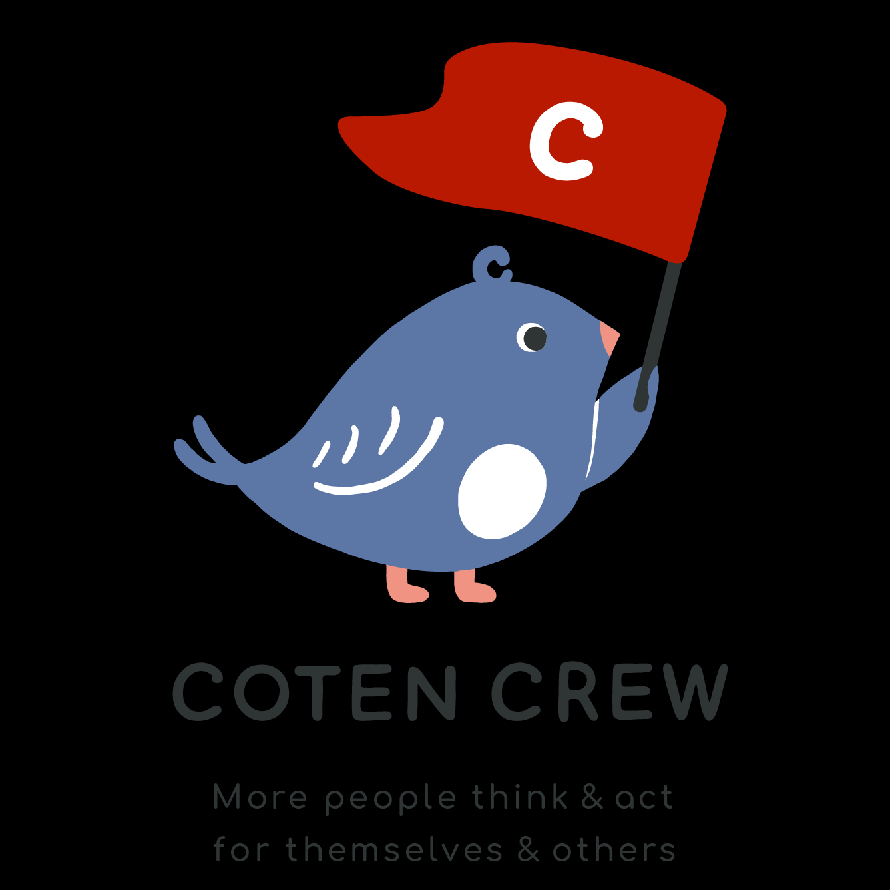

<!--
**itachi-P/itachi-p** is a ✨ _special_ ✨ repository because its `README.md` (this file) appears on your GitHub profile.
Here are some ideas to get you started:
-->
<h1 align="center">Hi there 👋</h1>
Now Studying:

[;Golang学習再開;%22SOFT+SKILLS%22　読書中;Podcast　「ひまプロ」　拝聴中)](https://git.io/typing-svg)

I'm programmer👩‍💻 and I love animals**🐻🐯🐘🦝🦊🐹🦇🦎🐝🐛🍄** and vegetable curry🍛.  
I like <a href="https://www.youtube.com/c/cotenradio">COTENRADIO</a> and I'm COTENCREW. 

Other favorite audio contents:

  
- [a scope 〜資本主義の未来編](https://open.spotify.com/show/6Wg8C5S0lonShoWReujAip)
- [ゆる言語学ラジオ](https://podcasters.spotify.com/pod/show/yurugengo) & [ゆるコンピュータ科学ラジオ](https://www.youtube.com/@yurucom)
- [ひまじんプログラマーの週末エンジニアリングレッスン](https://open.spotify.com/show/2uv9mONog0nr9q5YJJsvIt?si=e79fc99f3ecd4b8f)
- [エンジニアストーリー by Qiita](https://pitpa.jp/playlist/engineerstory)

#### Recent study records

  
Recently created Apps & Next idea

  
- [ぬこ🐈画像ジェネレータ](https://random-cat-git-feature-itachi-p.vercel.app/)  
- [世界のお天気⛈️🌞🌪️](https://weather-report-react-ts.netlify.app/)
- [コロナ😷💉トラッカー(**感染者数データは~~デマ~~デモ用**)](https://567-tracker.netlify.app/)
- [Next.js公式テストブログ📝アプリ](https://nextjs-testapp02-blog.netlify.app/)+α
- [GraphQLでAPI開発やってみた](https://graphql-prisma-supabase.vercel.app/)
- **Next👉** _GolangでFintech自動売買アプリ(**GitHubリポジトリはprivate**)_
- **自分で使いたい**と思うスマホアプリ開発 (Go mobile, Go Cloud | Flutter | React Native)
  - 読書支援アプリ
  - 集中力訓練アプリ
  - 習慣形成アプリ　（以前Flutter & Firebaseで作って非公開のもの）

#### Other items created past :
  
- Python & Selenium & pandas🐼 ~~&FastAPI~~ によるWebスクレイピング _（API化は未実装）_
- PHP & Laravel & Docker & AWS ECS (料金節約のため稼働停止中）
- Flutter & Firebase & NoSQL による30日間習慣形成スマホアプリ（非公開）

  
Reading Books

##### Now reading

- [SOFT SKILLS ソフトウェア開発者の人生マニュアル 第2版](https://www.amazon.co.jp/dp/4296000500/)
  

    
書籍詳細（特に気になるトピックメモ）

    
  overview:  
  - "1.Career"  
  - "2.Self Marketing"  
  - "3.Learning":
    - "27.学び方を学ぶ"  
    - "31.メンターの探し方"  
    - "32.メンターになる方法"  
  - "4.Productivity":
    - "36.全ては集中から始まる"  
    - "40.自分に対して責任を取る"  
    - "43.時間浪費のメカニズム"  
    - "45.効果的な習慣の育て方"  
  - "5.Investing"  
  - "6.Fitness"  
  - "7.Mindset":
    - "73.ストア哲学によって人生が変わる理由"  
           
  

- [「頭のゴミ」を捨てれば、脳は一瞬で目覚める!](https://www.amazon.co.jp/dp/B00JP3222M/)
  
###### Recently read books:
  
- [世界は贈与でできている　資本主義の「すきま」を埋める倫理学](https://www.amazon.co.jp//dp/B085NJC1HD/)
- [Humankind 希望の歴史(上)　人類が善き未来をつくるための18章](https://www.amazon.co.jp/dp/4163914072/)
- [「孟子」は人を強くする](https://www.amazon.co.jp/dp/4396111290/)
- [宇宙は何でできているのか　素粒子物理学で解く宇宙の謎](https://www.amazon.co.jp/gp/product/B00CZCWBPS/)

### Technologies I've used in the past:

  <a href="https://skillicons.dev">
     
     
     
     
  </a>

### Recent learning Languages & Tools:

  
  
  
  
  
  
  
   
<!--   
   
   
-->
   
<!--
  
  
  
  
  
-->

